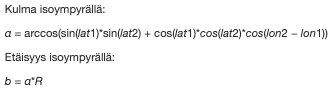

SQL
===

Pääkysymys:
    Miten hallita SQL-tietokantaa Python-ohjelmasta?

Mitä käsitellään?
    Python modulia nimelä sqlite.
    
Mitä sinun oletetaan tekevän?
    Lue ohjeet ja tee tehtävät.

Suuntaa antava vaativuusarvio:
    Helpohko.

Suuntaa antava työläysarvio:
    2-3 tuntia.

Ohjelmointitehtävät:
    Tehtävät ja niiden testit löytyvät omista hakemistoistaan. 
    
Yleistä
-------
   
Demografia
..........

Kaikissa tehtävissä käytetään alla olevaa tietokantaa, johon on ladattu suuri määrä maailman kaupunkeja ja niiden asukasmääriä ja koordinaatteja. Tietokannassa on vain yksi taulu, jonka tietueet kuvaavat maailman kaupunkeja.

Tietokannan rakenne
...................

Ennen tehtävien aloittamista kannattaa tutkia tietokannan tietoja. Missä muodossa kaupunkien ja valtioiden nimet on annettu?

+----------------------------------------------------+
|  .. code-block:: sql                               |
|                                                    |
|    TABLE kaupungit                                 |
|                                                    |
|        id           integer primary key            |
|                                                    |
|        nimi         text                           |
|                                                    |
|        alue         text                           |
|                                                    |
|        valtio       text                           |
|                                                    |
|        populaatio   integer                        |
|                                                    |
|        lat          real                           |
|                                                    |
|        lon	        real                         |
|                                                    |
+----------------------------------------------------+

SQL-kutsut Python-ohjelmassa
----------------------------

Python-ohjelmista voidaan suorittaa SQLite-tietokannan komentoja lataamalla kirjasto sqlite3:

.. code-block:: python

  import sqlite3

Kanta avataan komennolla 'connect':

.. code-block:: python

  conn = sqlite3.connect("tietokanta.db")

Lisäksi tarvitaan ns. tietokantakursori, joka tässä yhteydessä antaa tietokannalle komentoja ja 
vastaanottaa siltä tietoa:

.. code-block:: python

  c = conn.cursor()
  
Nyt voitaisiin suorttaa esimerkiksi seuraavanlainen SQL-komento c.execute()-metodilla:

.. code-block:: python

  command = 'SELECT COUNT(*) FROM kaupungit'
  c.execute(command)

Komentoja on helppo formatoida, jolloin osa komennon parametreista voidaan määritellä muuttujissa. 
Kysymysmerkit korvataan annetulla listalla muuttujia samassa järjestyksessä. 

.. code-block:: python
    
    c.execute("""INSERT INTO kaupungit(nimi, alue, valtio, populaatio, lat, lon)
                 VALUES(?,?,?,?,?,?)""",
                 [nimi, alue, valtio, populaatio, lat, lon])

Jos tietokantaan tehdään muutoksia (UPDATE, INSERT, DELETE), ne täytyy vielä kommitoida. Lisäksi
on hyvä tapa aina sulkea tietokanta lopuksi. Päivitykset on hyvä tehdä try-lohkossa, jonka 
päätteeksi tietokanta suljetaan. 

.. code-block:: python
  
    try:
        # Päivitetaan tiedot
        c.execute("UPDATE kaupungit SET populaatio = ? WHERE nimi = ?", [635181, "Helsinki"])
        # Tallennetaan tehdyt muutokset tietokantaan
        conn.commit()

    finally:
        conn.close()

Vihjeitä
........

Jos seuraavissa tehtävissä konsoliin tulostuu virheilmoitus, jossa kerrotaan, että tietokantaa tai jotain taulua ei löydy,

    Traceback (most recent call last):
      File "kaupunkihaku.py", line 56, in <module>
        main()
      File "kaupunkihaku.py", line 38, in main
        queryresult = find_city_by_name(inputstring, tietokanta)
      File "kaupunkihaku.py", line 14, in find_city_by_name    c.execute(sqlitecommand, [city_name])
    sqlite3.OperationalError: no such table: kaupungit
    
kannattaa antaa main()-funktion *tietokanta*-muuttujaan koko tiedostopolku, jossa tietokanta sijaitsee.
Saat nykyisen polun selville komennolla **pwd**:

    jovyan@jupyter-bythemark-2dxeus-2dsqlite-2dhrsbbmyq:~/kaupungit/teht1$ pwd
    /home/jovyan/kaupungit/teht1

Toinen vaihtoehto on siirtää tietokanta samaan kansioon kuin ajettava python-tiedosto.

Huom! Tietokanta luodaan automaattisesti, jos sitä ei löydy. Tietokanta on tällöin tyhjä, 
joten vaikka näyttäisi siltä, että tietokanta on oikeassa paikassa, se ei toimi.

  .. figure:: kuvat/tyhja_tietokanta.png

SQL-komennon palauttamat tietueet talteen
.........................................

Suoritettuasi esimerkiksi komennon

.. code-block:: python

  c.execute("""SELECT * FROM kaupungit;""")

Saat komennon palauttaman ensimmäisen tietueen talteen komennolla

.. code-block:: python

  tietue = c.fetchone()

Saat kaikki komennon palauttamat tietueet talteen komennolla

.. code-block:: python

  tietueet = c.fetchall()  #palauttaa kaikki c.excecute()-komennon palauttamat tietueet listana

Tehtävä 1: Kaupunkihaku
-----------------------

Täydennä Python-ohjelmaa ``kaupunkihaku.py``, joka etsii
tietokannasta nimen perusteella kaupungin ja tulostaa sen nimen,
alueen, valtion, asukasmäärän sekä koordinaatit. Lue olemassa oleva koodi ja
sen kommentointi ennen kuin alat kirjoittaa ratkaisua.

Huomaa, että kaupungin nimellä hakiessa voi tulla useita tuloksia.
Tällöin halutaan se kaupunki, jossa on eniten asukkaita. Helpoin tapa
valita väkimäärän perusteella on lisätä hakukomentoon
``ORDER BY populaatio DESC`` eli järjestä laskevasti väkimäärän
mukaan. Tällöin suurin kaupunki on listassa ensimmäinen.

Tehtävä 2: Tietojen päivittäminen
---------------------------------

Merkistöistä
............

Ennen seuraavan tehtävän aloittamista kannattaa tutkia tehtäväpaketin mukana tulleita tiedostoja.
Mitä `merkistöä <https://fi.wikipedia.org/wiki/Merkist%C3%B6>`_ esimerkiksi `tekstitiedosto <https://fi.wikipedia.org/wiki/Tekstitiedosto>`_ kaupungit.txt käyttää?
Ongelmien välttämiseksi tiedoston avaamisen yhteyteen on syytä lisätä tieto käytetystä merkistöstä.
Python 3:ssa se onnistuu lisäämällä määre **encoding** esimerkiksi seuraavasti

.. code-block:: python

  f = open(filename, 'r', encoding='utf-8')
  
Tehtäväpaketin mukana tulee tiedosto *suomen_suurimpien_kuntien_asukasluvut.txt*, jossa on listattuna Suomen suurimpien kuntien asukaslukuja.
Tehtävänäsi on tiedostoa hyödyntämällä päivittää kaupunkien asukasluvut. Jos tiedostossa olevaa kaupunkia ei löydy tietokannasta, ohita kyseinen kaupunki.
Älä kuitenkaan luo uutta kaupunkia tietokantaan. 

Tehtävä 3: Kahden kaupungin etäisyys
------------------------------------

Tee Python-ohjelma, joka etsii kaksi kaupunkia tietokannasta
nimen perusteella ja laskee niiden välisen etäisyyden. Voit käyttää
apunasi edellä tehtyä kaupunkihakua. Huomioi,
että samannimisistä kaupungeista halutaan se, jolla on suurin asukasluku.

**Vihje.** \ Etäisyys koordinaattien välillä kannattaa laskea
isoympyrän kulman avulla. Pisteiden ``(lon1,lat1)`` ja
``(lon2,lat2)`` väliselle etäisyydelle saadaan seuraavat yhtälöt, jos
Maapallon säde on R. Muista pohtia, oletko käyttämässä radiaaneja vai
asteita. Käytä ratkaisussasi math-kirjaston funktioita, testiohjelma ei
lataa esim. numpyä.

Miten voin testata tehtävien toimivuutta?

#. Etsi SQLite DB Browserilla joku kaupunki tietokannasta ja tutki löytääkö ohjelma sen.

#. Tietojen päivittämisen jälkeen tutki SQLite DB Browserilla ovatko tiedot päivittyneet tietokantaan.

#. Laske esimerkiksi laskimella oikea tulos ja vertaa sitä ohjelmasi palauttamaan tulokseen.
